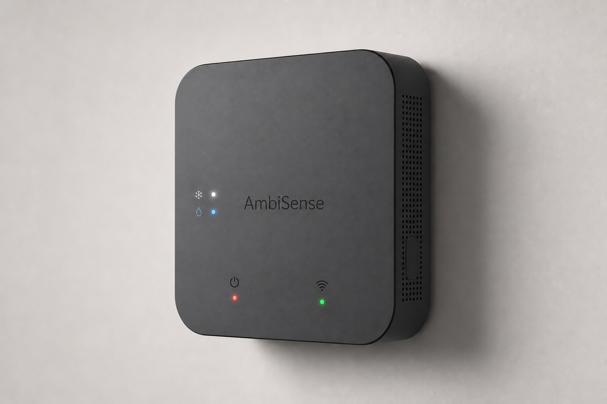
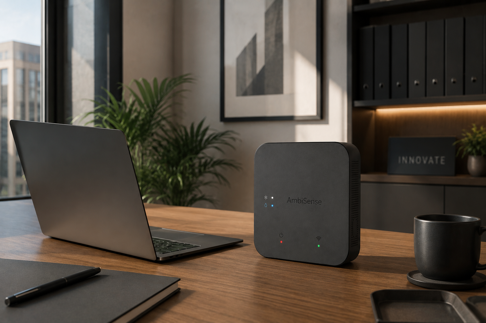
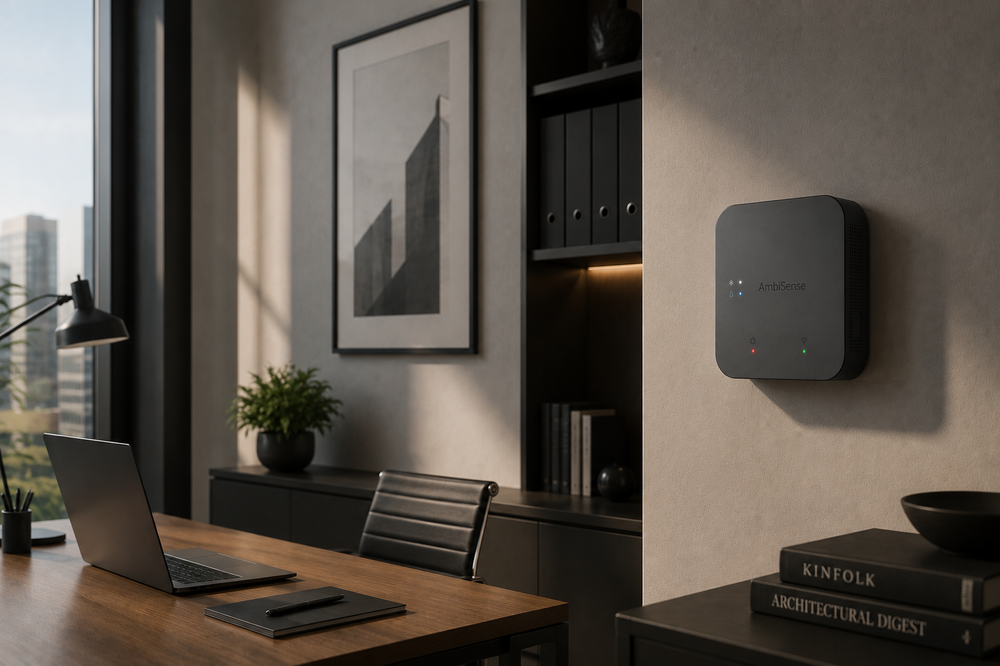
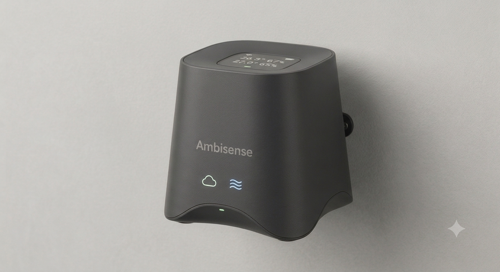
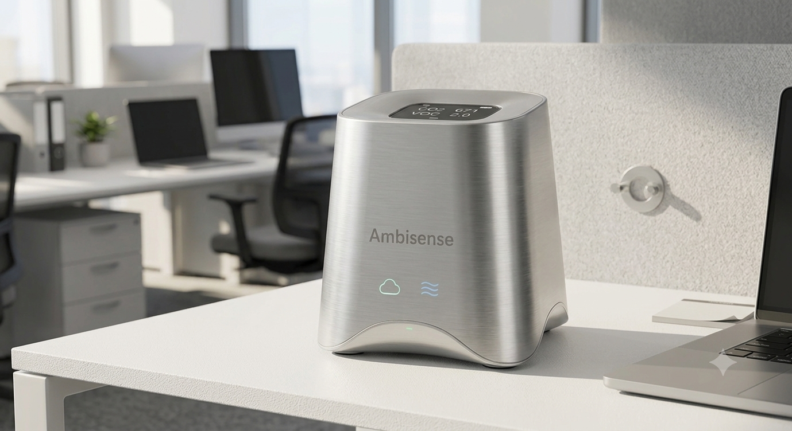
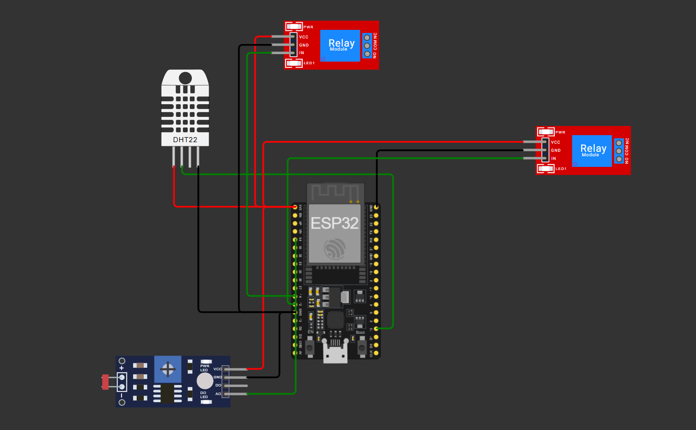

# AmbiSense 🌿 | IoT Climate Control System

Quantas vezes um AC fica ligado numa sala vazia? Foi essa pergunta simples que deu origem ao AmbiSense.

É um controlador climático inteligente pensado para espaços corporativos: evita o desperdício de energia desligando o AC e o humidificador quando a sala está desocupada, mas sem sacrificar o conforto de quem lá está — o sistema monitoriza tudo em tempo real e só corta a climatização quando tem a certeza de que não há ninguém para sentir a diferença.

*Conceitos do AmbiSense:*

## Arquitetura

Desenvolvido em **C++** para o **ESP32**.

A decisão mais importante do firmware foi abandonar o `delay()`. A razão é simples: `delay()` bloqueia o processador — e enquanto ele está parado à espera, o servidor web embutido fica sem resposta. Num sistema que precisa de estar sempre acessível para mostrar dados e receber comandos, isso não é aceitável. Por isso, toda a lógica principal corre numa **Máquina de Estados não-bloqueante** (baseada em `millis()`), que garante que o servidor web nunca perde resposta, mesmo enquanto o sistema lê sensores ou decide se atua nos relés.

* **Processamento & IoT:** Microcontrolador ESP32 (Wi-Fi e Web Server)
* **Sensores:** DHT22 (Temperatura/Humidade) e LDR (Deteção de Ocupação)
* **Atuação Segura:** Isolamento galvânico via Relés Optoacoplados, para comutação segura de cargas de 230V

## Validação de Circuito (Wokwi)

O circuito foi validado em simulação no Wokwi, confirmando as ligações entre ESP32, DHT22, LDR e os módulos de relés.

## Como Funciona o "Eco Mode"

O sistema nunca decide só com base na temperatura — cruza sempre os dois sensores:

1. O DHT22 mede a temperatura da sala
2. Se ela ultrapassar o limiar de conforto definido, o sistema não liga logo o AC
3. Primeiro verifica o LDR: a sala está vazia e às escuras?
4. Se sim, os relés não atracam — não há ninguém para sentir o calor, por isso não vale a pena gastar energia
5. Só quando o LDR deteta presença é que a climatização é ativada

É o mesmo princípio das luzes com sensor de movimento em escritórios, aplicado ao clima.

## Como Testar / Instalar

**Requisitos**

* Arduino IDE com o suporte de placas ESP32 instalado
* Biblioteca `DHT sensor library`
* *`WiFi.h` e `WebServer.h` não precisam de instalação separada: já vêm incluídos no core do ESP32 para Arduino*

**Ligações (conforme o esquema do circuito)**

| Componente | Pino no ESP32 |
|---|---|
| DHT22 — Data | GPIO 15 |
| LDR — Saída Analógica (AO) | GPIO 34 |
| Relé 1 (Ar Condicionado) — IN | GPIO 12 |
| Relé 2 (Humidificador) — IN | GPIO 14 |

**Passos**

1. Clonar este repositório e abrir o `.ino` no Arduino IDE
2. Selecionar a placa correta (ex: "ESP32 Dev Module") na IDE
3. Este projeto foi validado no Wokwi, onde a rede Wi-Fi simulada é `Wokwi-GUEST` (sem password) — essas duas linhas (`ssid` e `password`) estão fixas diretamente no código. Para usar em hardware real, é só substituir pelos dados da tua rede Wi-Fi
4. Fazer upload para o ESP32
5. Abrir a Serial Monitor a **115200 baud** — o IP local aparece ali depois da ligação Wi-Fi
6. Aceder a `http://<IP>/` no browser para ver o dashboard (atualiza automaticamente a cada 2 segundos)

## Possíveis Próximos Passos

- [ ] Guardar histórico de leituras para analisar padrões de uso ao longo do dia
- [ ] Notificações quando o limiar de conforto é excedido por muito tempo com a sala ocupada
- [ ] Calibração automática do LDR para diferentes níveis de luz ambiente

## Autor

Mateus de Mello Gonçalves — projeto pessoal
